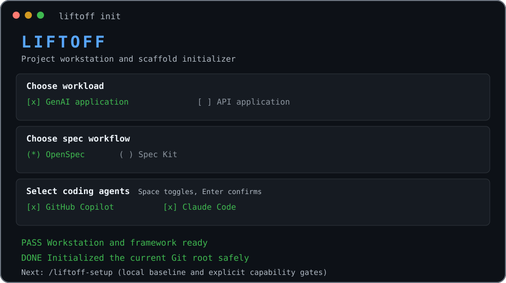

# Liftoff

**Initialize governed GenAI applications, APIs, and Power Apps code apps from one
interactive CLI.** Liftoff combines production-oriented scaffolds with OpenSpec or
Spec Kit and integrates GitHub Copilot, Claude Code, or both from the first commit.

[](https://www.npmjs.com/package/@msn-control/liftoff)
[](https://github.com/voyager163/liftoff/actions/workflows/ci.yml)
[](LICENSE)
[](package.json)

## Start here

Install the published CLI from canonical npm:

```bash
npm install -g @msn-control/liftoff@latest
```

Primary path:

```text
liftoff init my-project
cd my-project
/liftoff-setup
```

`liftoff init` asks for workload, spec workflow, agents, readiness, and plan
confirmation before writing local files. Repository governance is enabled by
default as a local deterministic handoff. `/liftoff-setup` then completes,
syncs, and archives the generated bootstrap seed through local baseline checks,
then stops at explicit authority gates for repository publication, credentials,
billed infrastructure or exceptions, final enforcement, destructive cleanup, and
external blockers. No model selection is required for setup; the CLI phase graph,
evidence, and approvals are authoritative.

After the first self-upgrade-capable release is installed globally through npm,
later CLI releases use `liftoff upgrade --check` followed by `liftoff upgrade`.
This replaces the CLI only; generated projects use `liftoff update` separately
for Liftoff-managed core files. Useful read-only checks:

```bash
liftoff validate
liftoff doctor
liftoff upgrade --check
liftoff update --check
```

Plain `liftoff update` applies safe managed-core changes immediately and skips
core conflicts. Application source, dependencies, schemas, containers,
environments, documentation, and infrastructure are project-owned after
generation and remain outside every update mode, including `--force`. Use
`liftoff update --check --json` for a read-only core-maintenance gate.

Projects generated before `0.10.2` may still display the retired
`/liftoff-repository-governance` command. Review `liftoff update --check`, then
remove that generated alias with:

```bash
liftoff upgrade
liftoff update --force
```

Reload the coding-agent session afterward so its command index refreshes.



## One flow, three workloads

| Workload | Generated foundation | Deferred until you choose |
| --- | --- | --- |
| **GenAI application** | Python, FastAPI, PydanticAI, data and messaging boundaries, optional frontend, Docker, and Azure OpenTofu | Model credentials, cloud sign-in, deployment |
| **API application** | Python/FastAPI, Node.js/Fastify, or Go/Huma API, database assets, optional frontend, Docker, and Azure OpenTofu | Service configuration, cloud sign-in, deployment |
| **Power Apps code app** | Microsoft's pinned React, Vite, TypeScript, Power Apps SDK starter and project-local CLI | Environment binding, connectors, `power-apps push` |

If the GenAI specialization is not yet known, choose **I'm not sure yet -
Generic GenAI starter** or use `--pattern generic`. It creates a neutral
PydanticAI invocation foundation without assuming RAG, chat, agents, streaming,
fine-tuning, or workflows.

Every workload can use **OpenSpec** or **Spec Kit** with **GitHub Copilot**,
**Claude Code**, or both. The optional Microsoft Code Apps agent plugin remains an
explicit, Preview-only choice.

[Compare workload questions and outputs](docs/workloads.md) |
[Choose a spec workflow and agents](docs/spec-workflows-and-agents.md)

## Existing repository friendly

Run `liftoff init` at the exact current Git root to initialize that repository in
place; Liftoff does not create an unnecessary child folder. In other locations, a
project name creates a named child directory.

All output is rendered and validated in temporary staging first. Liftoff discloses
regular-file replacements, asks before overwrite, rejects structural and symlink
conflicts, keeps tool/dependency permissions independent, and rolls back handled
write failures.

[Initialize an existing repository](docs/existing-repositories.md) |
[Understand target and consent safety](docs/safety-and-consent.md)

## Documentation

| Guide | Use it to |
| --- | --- |
| [Getting started](docs/getting-started.md) | Install safely and complete the first interactive project |
| [Workloads](docs/workloads.md) | Compare GenAI, API, and Power Apps choices and outputs |
| [Spec workflows and agents](docs/spec-workflows-and-agents.md) | Configure OpenSpec, Spec Kit, Copilot, Claude, and the optional Code Apps plugin |
| [Repository governance](docs/repository-governance.md) | Review `/liftoff-setup`, read-only `/liftoff-governance-assess`, authority gates, evidence, and compatibility |
| [Existing repositories](docs/existing-repositories.md) | Understand in-place, child-directory, and migration behavior |
| [Prerequisites](docs/prerequisites.md) | Review plan-derived runtimes, tools, authentication, and dependency setup |
| [Supported stack baseline](docs/supported-stack.md) | Review pinned runtimes, frameworks, dependency locks, images, and refresh policy |
| [Safety and consent](docs/safety-and-consent.md) | Review staging, overwrite, setup authority, credential, rollback, and ownership guarantees |
| [Telemetry and privacy](docs/telemetry.md) | Review collected fields, opt-outs, Azure processing, and retention |
| [CLI reference](docs/cli-reference.md) | Find commands, flags, terminal modes, JSON, and exit-code contracts |
| [Generated project structure](docs/project-structure.md) | Locate workload-specific and conditional generated areas |
| [Configuration and manifests](docs/configuration-and-manifests.md) | Edit desired state, manifest v7, activation identity, and managed artifacts |
| [Azure deployment](docs/azure-deployment.md) | Review generated Azure and OpenTofu contracts for API workloads |
| [Troubleshooting](docs/troubleshooting.md) | Recover from registry, readiness, validation, update, and plugin issues |
| [Developer guide](DEVELOPER.md) | Maintain version vectors, compatibility maps, release checks, and publishing |

## Contributing and security

See [CONTRIBUTING.md](CONTRIBUTING.md) and [DEVELOPER.md](DEVELOPER.md) for build,
test, packaging, starter-refresh, compatibility, and release procedures. Report
vulnerabilities through the private process in [SECURITY.md](SECURITY.md).

Liftoff is licensed under [GPL-3.0-only](LICENSE).
