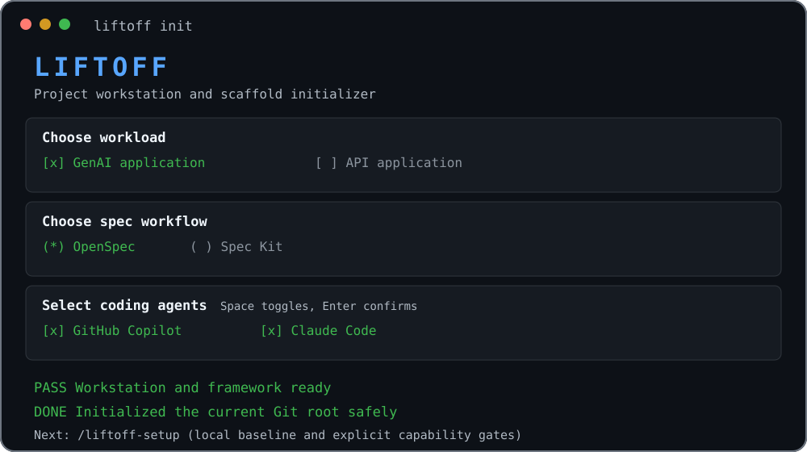

<div align="center">


# Liftoff

### Launch governed GenAI applications and APIs.

Reviewable starter projects, spec-driven workflows, and your choice of coding agents.
One interactive CLI to give your next project a considered start.

[](https://www.npmjs.com/package/@msn-control/liftoff) [](https://github.com/voyager163/liftoff/actions/workflows/ci.yml) [](docs/prerequisites.md) [](LICENSE)

[Quick start](#quick-start) · [Documentation](#documentation) · [Contributing](#contributing) · [Security](SECURITY.md)

</div>

## Quick start

Use **Node.js 24 LTS, version 24.20.0 or newer within that line**; check [prerequisites](docs/prerequisites.md).

```bash
npm install -g @msn-control/liftoff@latest
liftoff --version
liftoff init my-project
cd my-project
```

On builds advertising `schemas.currentGeneration` in `liftoff capabilities --json`,
initialization writes v8. Inspect it with `liftoff validate`, `liftoff doctor`,
and, when governed, `liftoff governance status --scope local --json`.

With a selected agent and governance, invoke `/liftoff-setup` in **GitHub Copilot** or **Claude Code**, or `$liftoff-setup` in **Codex**.
These are native agent invocations, not a `liftoff setup` shell command.

Choose your workload, workflow and agents; review the plan before writing files.
No model selection is required for setup. Local-only use is supported; publication,
cloud activation, deployment and live governance need separate approval.

Manual creates no external framework or bootstrap seed; OpenSpec and Spec Kit use
their official initializers. Generation is not local completion or fresh OpenSpec
finalization: use only advertised operations and supported inputs.
For managed registries, follow [installation guidance](docs/getting-started.md#1-install-the-cli), not a policy bypass.



## One flow, two workloads

| Start with | Build on | Choose later |
| --- | --- | --- |
| **GenAI application** | Python, FastAPI, PydanticAI, optional frontend, Docker, and Azure OpenTofu | Model credentials, specialization, and deployment |
| **API application** | Python/FastAPI, Node.js/Fastify, or Go/Huma, plus database and optional frontend assets | Service configuration, cloud sign-in, and deployment |

Not sure about your GenAI architecture yet? Choose **Generic GenAI starter**
(`--pattern generic`) for a neutral foundation, without assuming RAG or agents.

Choose **OpenSpec** (default), **Spec Kit**, or **Manual**, with **GitHub Copilot**,
**Claude Code**, **Codex**, or a combination. Only Manual permits no agents
(`--spec manual --agents none`). See [workloads](docs/workloads.md) and [workflows and agents](docs/spec-workflows-and-agents.md).
Power Apps is retired; it is not an available creation or conversion path.

## Work with an existing project

Run `liftoff init` at the **exact current Git root** to initialize in place.
Liftoff stages and validates output, asks before replacing files, and keeps
installation and overwrite permissions separate. Do not reinitialize a project
to fix a verification blocker.

For maintenance, `liftoff upgrade --check` previews a CLI upgrade;
`liftoff update --check` previews managed project changes before explicit approval.
An upgrade replaces the CLI only; generated projects use `liftoff update` separately
for reviewed project maintenance. Application files remain project-owned.
Builds advertising `schemas.currentUpdate` preview v8 successors or maintenance,
preserving workflow, profile, plugins and layout. Recovery requires
`liftoff update <project> --recover --approve-plan <saved-fingerprint>`; local verification stays separate.

On builds that provide it, `liftoff capabilities --json` lists installed public
interfaces without project discovery or telemetry. Check advertised schemas
before following newer guidance; planned features are not installed support.

| Advertised schema | Separate public interface |
| --- | --- |
| `schemas.currentGeneration` | Fresh v8 `plan`, `init`, and sibling `migrate`, including framework-free Manual and optional agents. |
| `schemas.currentUpdate` | [V8 project update](docs/cli-reference.md#update-modes): exact preview/approval, preserved configuration and history, and fingerprint-selected recovery. |
| `schemas.modernLocalVerification` | [V8 verification](docs/cli-reference.md#modern-local-verification): explicit request, approval and execution, including separately consented locked Manual checks on the qualified native host; no conversion or publication. |
| `schemas.modernLocalCompletion` | [Manual/Spec Kit completion](docs/cli-reference.md#modern-local-completion): workflow-specific finalization, exact-file review and independent publication consent. |
| `schemas.modernSuccessorRevalidation` | [Existing-successor revalidation](docs/cli-reference.md#modern-successor-revalidation): fresh verification and separate exact-byte publication approval. Incomplete commit exits 2, preserving the active successor and history without downgrade. |

Recovery is explicit; saved progress is not current proof. These interfaces do not grant
team generation, fresh OpenSpec finalization, cloud operations or whole-directory rollback.

[Existing repositories](docs/existing-repositories.md) ·
[Safety and consent](docs/safety-and-consent.md) ·
[Repair modes](docs/cli-reference.md#repair-modes) ·
[Application repair](docs/application-repair.md) (current v8 and historical recipes)

## Documentation

| Guide | Start here when you need to |
| --- | --- |
| [Getting started](docs/getting-started.md) | Install and complete your first local setup |
| [Prerequisites](docs/prerequisites.md) · [Supported stack](docs/supported-stack.md) | Check toolchains and tested version baselines |
| [Repository governance](docs/repository-governance.md) | Understand generated setup, approval gates, and read-only assessment |
| [CLI reference](docs/cli-reference.md) | Find commands, automation flags, repair modes, and exit codes |
| [Project structure](docs/project-structure.md) · [Configuration](docs/configuration-and-manifests.md) | Navigate generated files, ownership, and manifests |
| [Azure deployment](docs/azure-deployment.md) | Review infrastructure and deployment boundaries |
| [Telemetry and privacy](docs/telemetry.md) | Understand collected fields, retention, and opt-outs |
| [Troubleshooting](docs/troubleshooting.md) | Resolve registry, readiness, migration, and update blockers |
| [Developer guide](DEVELOPER.md) · [Native development bundles](docs/native-development-bundles.md) | Maintain compatibility and releases; native bundles are not a published installation or migration channel |

## Project status

Liftoff is actively developed; `develop` may be ahead of the latest release.
Planned work is not shipped support. Use [release notes](https://github.com/voyager163/liftoff/releases)
and [SECURITY.md](SECURITY.md) for version-specific guidance.

## Contributing

Bug reproductions, documentation, feature discussions, and code are welcome.
Start with [CONTRIBUTING.md](CONTRIBUTING.md), and send normal pull requests
to **`develop`**. Discuss substantial changes in an issue first.

[Get help](SUPPORT.md) · [Report a bug or suggest a feature](https://github.com/voyager163/liftoff/issues/new/choose) ·
[Project governance](GOVERNANCE.md) · [Code of Conduct](CODE_OF_CONDUCT.md)

Report vulnerabilities **privately** through [SECURITY.md](SECURITY.md).
Use the separate [conduct contact](CODE_OF_CONDUCT.md#reporting-and-enforcement)
for community concerns. Never include credentials or private data in public reports.

## License

Liftoff is open source under **[GPL-3.0-only](LICENSE)**.
Contributions use the same license; preserve applicable third-party notices.
